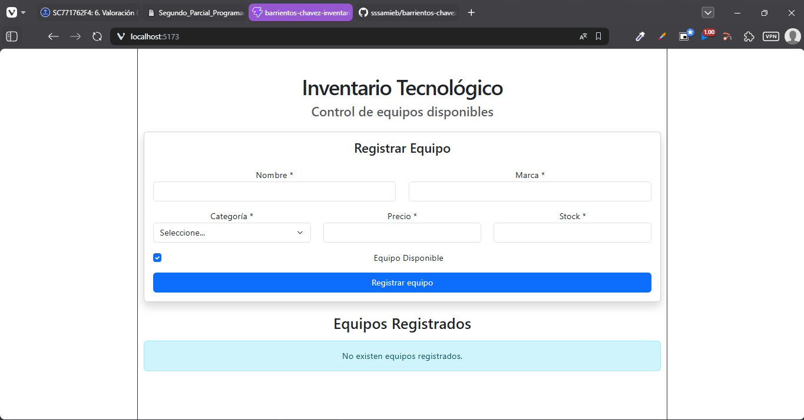
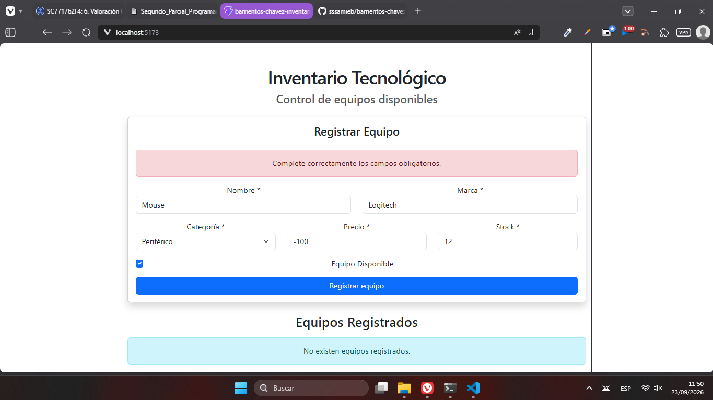
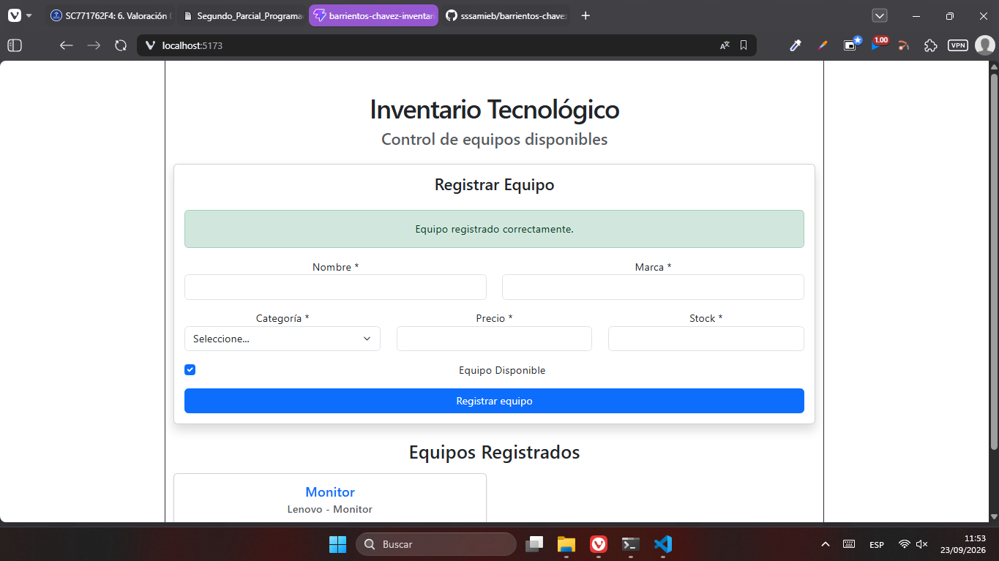
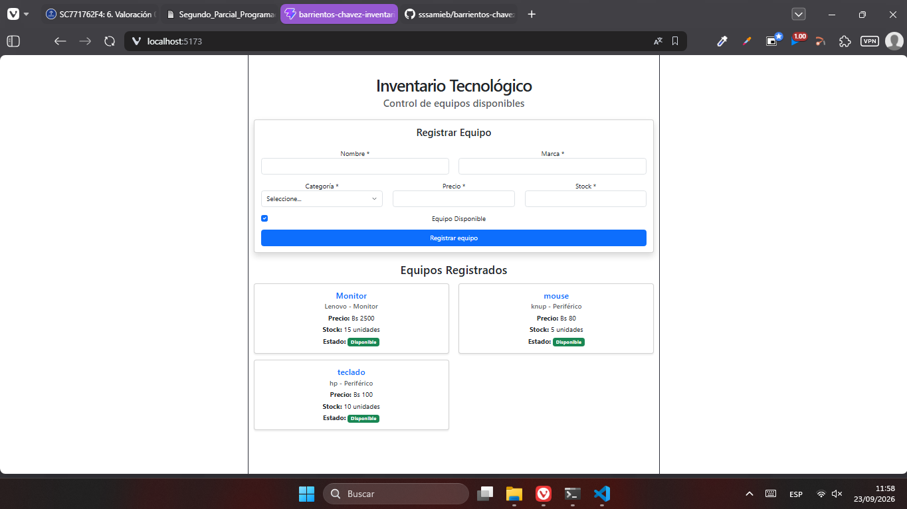

# Gestión de Inventario Tecnológico

**Estudiantes:** 
- Samira Nitza Barrientos Morales
- Carmen Rosario Chavez Hurtado

## Vistas del Proyecto

### 1. Interfaz Principal

### 2. Error al Ingresar

### 3. Ingresar Datos

### 4. Listado Dinámico de Equipos

## Descripción del Sistema
Esta es una aplicación frontend desarrollada para una pequeña empresa, la cual permite registrar y visualizar de forma dinámica los equipos tecnológicos disponibles en su inventario. Los datos se almacenan temporalmente en el estado local de React durante la ejecución de la aplicación.

## Funcionalidades Implementadas
* **Registro de equipos:** Formulario para ingresar el Nombre, Marca, Categoría, Precio, Stock y Estado de cada equipo tecnológico.
* **Listado dinámico:** Visualización inmediata de los equipos registrados en formato de tarjetas (cards) sin recargar la página.
* **Validaciones integradas:** Verificación de campos obligatorios, precios mayores a 0 y stock igual o mayor a 0 antes de procesar el registro.

## Tecnologías Utilizadas
* React
* Vite
* JavaScript
* Bootstrap
* Git y GitHub

## Instrucciones detalladas para ejecutar el proyecto

Sigue estos pasos para descargar y ejecutar la aplicación en tu entorno local:

**1. Clona el repositorio en tu computadora**
Abre tu terminal y ejecuta el siguiente comando:
> git clone https://github.com/sssamieb/barrientos-chavez.git

**2. Ingresa a la carpeta del proyecto**
Utiliza el comando cd para ubicar tu terminal exactamente dentro de la carpeta que acabas de descargar:
> cd barrientos-chavez

**3. Instala las dependencias necesarias**
Este proyecto utiliza librerías externas como React, Vite y Bootstrap. Para descargarlas, ejecuta:
> npm install

**4. Inicia el servidor de desarrollo**
Una vez que termine la instalación de los paquetes, levanta el entorno de Vite ejecutando:
> npm run dev

**5. Abre la aplicación en tu navegador**
La terminal te mostrará un enlace local (generalmente http://localhost:5173). Haz clic en él sosteniendo la tecla Ctrl, o cópialo y pégalo en tu navegador web. 

